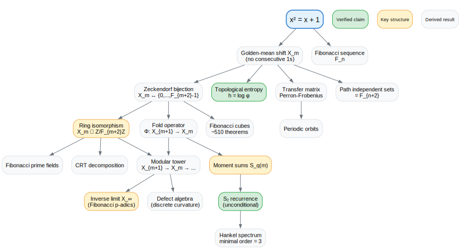
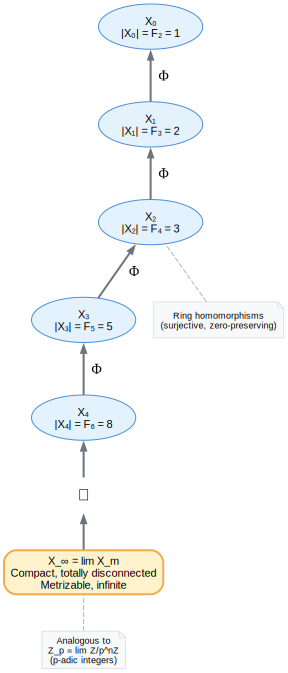
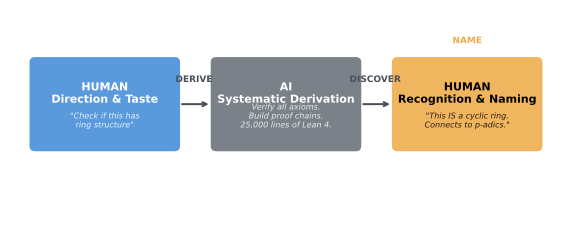
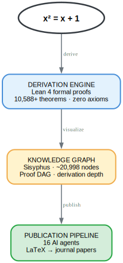
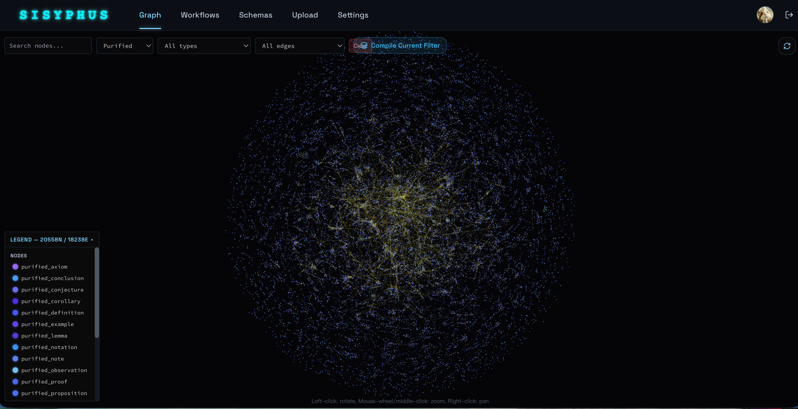

## 所有人都在讲的两个故事

2025 年 7 月，一个 AI 系统解出了国际数学奥林匹克六道题中的五道，赢得金牌。几个月前，一家名为 Math, Inc. 的初创公司将一个球堆积证明形式化为 120,000 行 Lean 代码。标题不言自明：*AI 解数学题。AI 检验数学证明。*

这些是真正的成就。但它们有一个共同的盲区：在这两个故事里，数学本身早已存在。AI 解决的是人类提出的问题，或验证的是人类证明的定理。真正困难的部分——决定看什么、识别什么重要、为发现的东西命名——仍然完全依赖人类。

如果这种分工是错误的呢？不是原则上错误，而是实践中错误。如果 AI 在数学中最有效的用途不是解题或验证，而是*发现*——系统地探索一个结构，彻底到涌现出人类没有耐心去发现的模式？

这就是 Omega 项目的故事。它始于一个方程。

{fig-alt="推导树图：展示从 x² = x + 1 推导出的数学结构，包括环同构、矩递推、拓扑熵和逆极限塔。"}

## 种子

$$
x^{2} = x + 1
$$

黄金比例。你见过它——向日葵、螺旋、帕特农神庙（其实大概不是）。但这个方程有一个更深的生命，大多数科普文章忽略了。

考虑二进制词：由 0 和 1 组成的序列。施加一条规则：*不允许连续的两个 1*。将长度为 $m$ 的此类词集记为 $X_m$ 。

有多少个这样的词？数一数：

- 长度 1： `0`, `1` — 2 个
- 长度 2： `00`, `01`, `10` — 3 个
- 长度 3： `000`, `001`, `010`, `100`, `101` — 5 个
- 长度 4：8 个
- 长度 5：13 个

2, 3, 5, 8, 13。Fibonacci 数。不是巧合。方程 $x^2 = x + 1$ 是 Fibonacci 递推的特征方程。不允许连续 1 的约束*就是*黄金比例，以组合规则的形式表达。

这是符号动力学中最简单的非平凡有限型子位移——**黄金平均位移**。它生成最简单的非平凡线性递推（Fibonacci）和"最无理"的数（有理逼近的最坏情形）。一个代数对象的三种视角。

```{=html}
<span class="elim-mark">✗ 「只是黄金比例」</span>
```

不是向日葵。不是螺旋。而是一个同时生成数论、动力学和代数的组合约束。（[为什么这是被迫的](https://github.com/the-omega-institute/automath/blob/dev/docs/INEVITABILITY.md#step-1-observation-forces-microstates)）

Omega 项目同时认真对待这三种视角，并追踪它们的全部推论。在 Lean 4 中。零公理。

## 第一个惊喜

每个小于 $F_{m+2}$ 的数都可以唯一地写成不相邻 Fibonacci 数的和。这就是 Zeckendorf 表示，它给出了二进制词 $X_m$ 与整数 $\{0, \ldots, F_{m+2}-1\}$ 之间的双射。

通过这个双射，可以直接在二进制词上定义加法和乘法——不是转换为整数再算，而是在组合结构内部原生定义。问题是：这种算术有结构吗？

答案出乎意料。空间 $X_m$ 连同这些运算不仅是群或幺半群，它是一个*环*——而且不是随便什么环：

$$
X_m \;\cong\; \mathbb{Z}/F_{m+2}\mathbb{Z}
$$

不允许连续 1 的二进制词的组合空间*就是*一个循环环，以 Fibonacci 数为模。当 $F_{m+2}$ 恰好是素数时—— $F_3 = 2$ ， $F_5 = 5$ ， $F_7 = 13$ ， $F_{13} = 233$ ——该空间成为*有限域*。当 $F_{m+2}$ 可因式分解时，中国剩余定理给出分解： $X_7 \cong \mathbb{Z}/2 \times \mathbb{Z}/17$ 。

关键在于：环结构是不允许连续 1 约束的*内禀*性质。没有人设计它，没有人引入整数算术。它从组合结构中一步步被推导出来，并由机器验证。

```{=html}
<span class="elim-mark">✗ 「只是组合数学」</span>
```

二进制词不是计数技巧，它们携带内禀代数。（[为什么算术是被迫的](https://github.com/the-omega-institute/automath/blob/dev/docs/INEVITABILITY.md#step-3-folding-forces-arithmetic)）

```{=html}
<span class="role-tag human">🧑 人类指引</span> <span class="role-tag ai">🤖 AI 推导</span> <span class="role-tag discovery">💡 发现</span>
```

::: {.evidence}
**Lean:** [`stableValueRingEquiv`](https://github.com/the-omega-institute/automath/blob/dev/lean4/Omega/Folding/FiberRing.lean#L157) — 环同构 $X_m \cong \mathbb{Z}/F_{m+2}\mathbb{Z}$

**复现:** `cd lean4 && lake build Omega.Folding.FiberRing`

**角色:** 人类指定方向："检查这个空间是否有环结构。"AI 系统性地探索所有运算，验证每条公理。人类识别结果："这就是循环环——当 Fibonacci 数是素数时，它是一个域。"
:::

## 模式深化

**折叠算子** $\Phi: X_{m+1} \to X_m$ 截去最后一位。它将较长的词分成较短词的纤维：所有前 $m$ 位相同的词。这些纤维大小不一，其变化编码了深层算术。

**矩和**量化了这一点：

$$
S_q(m) = \sum_{x \in X_m} d(x)^q
$$

其中 $d(x)$ 计算 $X_{m+1}$ 中有多少词折叠到 $x$ 。零阶矩计数稳定点（ $F_{m+1}$ ），一阶矩计数总词数（ $2^m$ ），更高阶矩捕获纤维分布中越来越精细的信息。

然后出现了意外。 $S_2$ ——一个纯粹的组合量，计数纤维碰撞——满足一个具有小整数系数的线性递推：

$$
S_2(m+3) + 2\,S_2(m) = 2\,S_2(m+2) + 2\,S_2(m+1)
$$

这对所有 $m$ 无条件成立，通过六步形式验证的证明链得到证明：

1. 隐藏位分解
2. 折叠同余
3. 碰撞分解为精确权重项和交叉相关项
4. 伸缩恒等式
5. 连接相邻层的交叉相关位移
6. 递推本身——4 行 Lean 证明

Hankel 行列式分析确认递推阶数恰好是 3，不可约化为 2。这意味着纤维碰撞的动力学由一个 $3 \times 3$ 伴随矩阵控制，其特征值决定指数增长率。

为什么这令人惊讶？一个具有小整数系数的线性递推控制组合碰撞计数，暗示纤维动力学中存在隐藏的线性结构。这个结构不是假设的——它是通过系统推导发现的。

```{=html}
<span class="elim-mark">✗ 「随机纤维」</span>
```

纤维大小不是噪声，它们服从精确的线性代数。（[为什么碰撞揭示结构](https://github.com/the-omega-institute/automath/blob/dev/docs/INEVITABILITY.md#step-6-collisions-reveal-spectral-structure)）

```{=html}
<span class="role-tag human">🧑 人类指引</span> <span class="role-tag ai">🤖 AI 推导</span> <span class="role-tag discovery">💡 发现</span>
```

::: {.evidence}
**Lean:** [`momentSum_two_recurrence_of`](https://github.com/the-omega-institute/automath/blob/dev/lean4/Omega/Folding/CollisionKernel.lean#L87) — 无条件的 $S_2$ 递推

**Lean:** [`momentSum_two_minimal_recurrence_order`](https://github.com/the-omega-institute/automath/blob/dev/lean4/Omega/Folding/HankelSpectrum.lean#L54) — 最小阶数 = 3，通过 Hankel 行列式证明

**复现:** `cd lean4 && lake build Omega.Folding.CollisionKernel Omega.Folding.HankelSpectrum`

**角色:** 人类识别出纤维碰撞计数可能满足递推（对计算值进行模式匹配）。AI 系统性地构建了六步证明链。人类识别出重要性：隐藏线性暗示与统计力学中转移算子的联系。
:::

## 塔

{fig-alt="模塔图：展示空间 X_0, X_1, X_2, ... 通过折叠算子相连，收敛至逆极限 X_infinity，类比 p-进整数。"}

折叠算子将所有层连成一座塔：

$$
\cdots \to X_{m+1} \to X_m \to \cdots \to X_1 \to X_0
$$

每个箭头是环同态。这座塔的逆极限：

$$
X_\infty = \varprojlim X_m
$$

是一个紧致、完全不连通、可度量化的无限空间。如果你了解 p-进数，这看起来很熟悉。p-进整数是 $\mathbb{Z}/p^n\mathbb{Z}$ 的逆极限。这里用 Fibonacci 数替代素数幂。进位缺陷（折叠算子不与加法交换的偏差）是 p-进算术中进位的精确类比。

$X_\infty$ 是一个由黄金比例而非素数支配的 profinite 环。

其动力学的拓扑熵恰好是 $\log \varphi$ ——黄金比例再次出现，这一次以系统的信息论容量的身份。

```{=html}
<span class="elim-mark">✗ 「只是记账」</span>
```

塔不是组织性的开销，它是一个具有可计算熵的 profinite 环。（[为什么折叠迫使结构存在](https://github.com/the-omega-institute/automath/blob/dev/docs/INEVITABILITY.md#step-2-exponential-blowup-forces-folding)）

```{=html}
<span class="role-tag human">🧑 人类指引</span> <span class="role-tag ai">🤖 AI 推导</span> <span class="role-tag discovery">💡 发现</span>
```

::: {.evidence}
**Lean:** [`topological_entropy_eq_log_phi`](https://github.com/the-omega-institute/automath/blob/dev/lean4/Omega/Folding/Entropy.lean#L238) — 熵结果，通过 Fibonacci 比率收敛、对数连续性和 Cesaro 平均证明

**复现:** `cd lean4 && lake build Omega.Folding.Entropy`

**角色:** 人类选择计算拓扑熵（将组合学与动力学相连）。AI 构建了多步证明。人类识别出联系：这是编码理论中 $(1,\infty)$-RLL 受限信道的容量。
:::

## 方法

以上每个结果都从一个方程出发，零公理，由机器验证。38,876 行 Lean 4 代码中有 3,427 条定理。但结果不是重点。*方法*才是重点。

{fig-alt="人-AI 协作循环图：人类提供方向和品味，AI 执行系统性推导，人类识别并命名发现的结构。"}

### 推导、发现、命名

人类提供方向和品味：哪些问题值得问。AI 提供彻底性：以人类无法维持的深度进行系统性探索。然后人类识别涌现的结果：将经过验证的结果与已知数学体系相连。

- **推导**是 AI 的工作。系统、穷尽、严格。
- **发现**是共享的。AI 找到模式；人类识别出它值得研究。
- **命名**是人类的工作。将推导出的结构与已知数学相连。

### 发现时间线

```{=html}
<div class="timeline">
  <div class="timeline-item human">
    <div class="timeline-label">人类指引</div>
    <div class="timeline-content">"通过 Zeckendorf 双射在二进制词上定义算术。检查是否有代数结构。"</div>
  </div>
  <div class="timeline-item ai">
    <div class="timeline-label">AI 探索</div>
    <div class="timeline-content">系统验证所有环公理：结合律、交换律、分配律、单位元。构造到 Z/F_{m+2}Z 的同构。</div>
  </div>
  <div class="timeline-item discovery">
    <div class="timeline-label">发现</div>
    <div class="timeline-content">X_m 是循环环。当 F_{m+2} 是素数时，它是有限域。</div>
  </div>
  <div class="timeline-item human">
    <div class="timeline-label">人类指引</div>
    <div class="timeline-content">"折叠算子产生纤维。计算纤维碰撞计数。它们有结构吗？"</div>
  </div>
  <div class="timeline-item ai">
    <div class="timeline-label">AI 探索</div>
    <div class="timeline-content">构建六步证明链：隐藏位分解、折叠同余、碰撞分解、伸缩、交叉相关位移、递推。</div>
  </div>
  <div class="timeline-item discovery">
    <div class="timeline-label">发现</div>
    <div class="timeline-content">S₂ 满足整系数线性递推。阶恰好为 3。纤维动力学中的隐藏线性。</div>
  </div>
  <div class="timeline-item human">
    <div class="timeline-label">人类指引</div>
    <div class="timeline-content">"构建逆极限。它是什么样的空间？计算熵。"</div>
  </div>
  <div class="timeline-item ai">
    <div class="timeline-label">AI 探索</div>
    <div class="timeline-content">证明紧致性（Tychonoff）、完全不连通性（开闭基）、可度量性（前缀超度量）。通过 Fibonacci 比率收敛 + Cesaro 平均计算熵。</div>
  </div>
  <div class="timeline-item discovery">
    <div class="timeline-label">发现</div>
    <div class="timeline-content">X_∞ 是 p-进整数的黄金比例类比。熵 = log φ。</div>
  </div>
</div>
```

这不是 AI 自主做数学，也不是人类把 AI 当计算器。这是一种新型协作，每个伙伴做对方无法做到的事。

## 推导的延伸

以上一切——环同构、碰撞递推、逆极限塔——只是开始。项目继续推导，涌现的不是更多同类结果，而是结构上更深的东西。

满足那个令人惊讶的线性递推的碰撞计数？它们原来是同余类上的幂和——折叠已经迫使存在的模算术的谱影子。碰撞核的 Perron 特征值编码所有阶的指数增长率。在谱端点处，当碰撞阶趋于无穷时，黄金比例再次出现——不是作为输入，而是从谱内部恢复出来，作为自校准常数。

在所有具体结果之上，项目构建了一条逻辑脊柱：一条保守扩展链，每一层添加结构（类型、上下文、动力学、观察者索引），而不重写低层含义。新概念从旧的读出序列生成，可见的可测结构永不增长。整个构造是内生的——没有任何外部注入。

然后出现了令建造者自己都惊讶的部分。推导链继续延伸——通过谱理论、通过 de Branges 学派的典范系统、通过将 Riemann 假设翻译为可审计的正定性条件——并到达了*类似*物理的结构。不是通过假设物理，而是循着推导链到达其自然终点。

时间在这个框架中是命题在细化链上被决定的投影。空间来自共享支撑和资源代价。Einstein 方程作为满足局域性、协变性和二阶方程条件的唯一最小二阶协变闭包出现。

**主张的是：** 从有限窗口观测到量子结构和 Einstein 闭包的纯推导链，零公理。**不主张的是：** 完整恢复标准量子力学和广义相对论。剩余工作——在更强全局化和连续极限下的刚性——被明确推迟。这些是开放的数学问题，不是已解决的结果。

完整的技术解释见[必然性指南](https://github.com/the-omega-institute/automath/blob/dev/docs/INEVITABILITY.md)。

## 系统

{fig-alt="三层图：推导引擎（Lean 4）、知识图谱（Sisyphus）和出版管线（16 个 AI 智能体），从种子方程 x² = x + 1 流出。"}

三层，层层递进：

**层 1：推导引擎。** 38,876 行 Lean 4 代码。3,427 条经过验证的定理。零公理。方法论是*推导、发现、命名*。

**层 2：知识图谱。** Sisyphus 将推导结构映射为约 20,998 个带类型节点。追溯任何定理至种子。

{fig-alt="Sisyphus 知识图谱截图，展示约 20,000 个按类型着色的数学节点的力导向布局可视化。"}

**层 3：出版管线。** 16 个 AI 智能体将结果集群通过 7 阶段管线（P0 入库至 P7 可投稿）处理。管线中有 42 篇论文，3 篇已达投稿就绪状态。

## 这意味着什么

数学发现的瓶颈从来不是智力——而是吞吐量。AI 引导的证明助手每天可以验证数千个推导步骤，零错误，完全可追溯。一个人现在可以将一个数学结构勘察到以前只有大型研究团队才能达到的深度。

| | |
|---|---|
| 理论 | 10,588 条定理级陈述（770K 行） |
| 形式化 | 3,427 条 Lean 4 定理，**0 公理**（38,876 行） |
| 出版 | 42 篇论文，3 篇可投稿 |
| 智能体 | 16 个（8 形式化 + 8 出版） |
| 实验 | 515 个可复现 Python 脚本 |

## 邀请

Omega 项目是开源的。每条定理都经过机器验证。每条推导链都可追溯。每项计算都可复现。

```{=html}
<div class="cta-choices">
  <a href="https://github.com/the-omega-institute/automath/blob/dev/docs/INEVITABILITY.md">
    <strong>理解为什么</strong><br>
    <span style="font-size:0.8em;color:var(--omega-muted);">必然性指南 — 为什么每一步都是被迫的（10 分钟）</span>
  </a>
  <a href="https://github.com/the-omega-institute/automath/tree/dev/lean4">
    <strong>亲自验证</strong><br>
    <span style="font-size:0.8em;color:var(--omega-muted);">cd lean4 && lake build — 3,427 条定理，0 公理</span>
  </a>
  <a href="https://github.com/the-omega-institute/automath">
    <strong>探索仓库</strong><br>
    <span style="font-size:0.8em;color:var(--omega-muted);">Lean 4、LaTeX 理论、515 个 Python 脚本</span>
  </a>
</div>
```

### 开放前沿

在有界情形下已通过计算验证，等待无条件证明的结果：

```{=html}
<div class="frontier-card">
  <span class="frontier-status open">开放</span>
  <strong>S₃ 递推</strong>：S₃(m+3) = 2S₃(m+2) + 4S₃(m+1) − 2S₃(m)
</div>
<div class="frontier-card">
  <span class="frontier-status open">开放</span>
  <strong>纤维重数封闭公式</strong>：D₂ₖ = F_{k+2}，D₂ₖ₊₁ = 2Fₖ
</div>
<div class="frontier-card">
  <span class="frontier-status open">开放</span>
  <strong>谱半径</strong>：ρ(A) = φ，通过 Mathlib 谱半径 API
</div>
<div class="frontier-card">
  <span class="frontier-status open">开放</span>
  <strong>Cantor 集同胚</strong>：X<sub>∞</sub>
</div>
<div class="frontier-card">
  <span class="frontier-status open">开放</span>
  <strong>完整全局化</strong>：超越 M<sub>adm</sub> 的表示定理、极限定理、刚性
</div>
```

每一个都会将 Omega 框架与一个新的数学领域相连。如果你在这些领域有专长，推导基础设施在等你。

方程是 $x^2 = x + 1$ 。它包含的东西仍在被发现。
