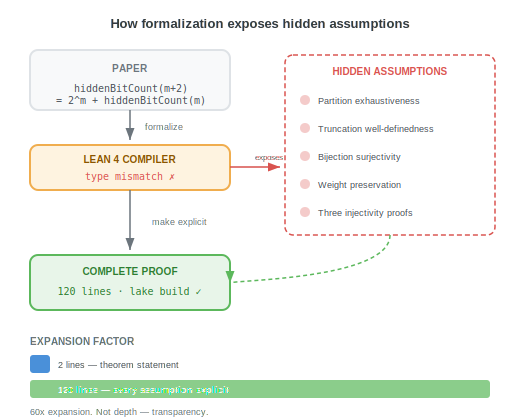

## 那条错误信息

```lean
theorem hiddenBitCount_recurrence (m : Nat) :
    hiddenBitCount (m + 2) = 2 ^ m + hiddenBitCount m
```

两行。一个关于 Fibonacci 加权和超过阈值的单词计数的递推关系。按一个比特位分区，分别计数两边。任何组合学家都会说这很直接。

Lean 4 编译器不同意。它要求 120 行证明。[^hook]

不是因为数学有错。而是因为数学*不完整*。这两行陈述默默地假设了：

- 按单个比特过滤恰好产生两个不相交的子集，覆盖所有情况（分区完备性）
- 去掉一个单词的最后两个比特保持目标集合的成员资格（截断良定义性）
- 追加比特构造了一个有效的逆映射，且双射保持权重（满射性 + 权重守恒）
- 这些双射中的每一个都是单射的，需要对三个下标范围进行分情况讨论

四个隐形假设。每一个都是人类读者填入"显然"然后继续的地方。每一个都是编译器停下来说 *证明它* 的地方。

{fig-alt="一个流程图，展示两行定理陈述被 Lean 4 编译器拒绝，暴露出五个隐形假设（分区完备性、截断良定义性、双射满射性、权重守恒、三个单射性证明），这些必须被解决才能产出 120 行的完整证明。条形图展示了 60 倍的展开系数。"}

[^hook]: [`hiddenBitCount_recurrence`](https://github.com/the-omega-institute/automath/blob/dev/lean4/Omega/Folding/MaxFiberTwoStep.lean#L73), Omega/Folding/MaxFiberTwoStep.lean, 第 73--194 行。

## 第一幕：编译器不会读你的心

如果你写软件，你已经知道这种感觉。

你把一个 JavaScript 代码库迁移到 TypeScript。代码之前运行得好好的。能跑，测试通过，用户满意。然后类型检查器亮起来了： `undefined is not assignable to type string` 。一行接一行。不是因为代码坏了，而是因为它依赖于从未写下的假设。 `user.email` 总是字符串。API 响应总是有 `data` 字段。数组永远不为空。

TypeScript 没有给你的程序添加新逻辑。它添加了一个要求：*说清楚你的意思*。声明 `email` 是 `string | undefined` ，处理 `undefined` 的情况，突然一整类运行时错误变得不可能了。类型系统迫使你面对你一直在默默做出的假设。

Lean 4 做的是同样的事情，但对象是数学。

Lean 是一种依赖类型编程语言，类型可以表达命题，程序可以充当证明。当你写 `theorem P : Prop` 时，你在声明一个类型。当你写证明项时，你在构造那个类型的一个值。如果证明编译通过，它就是正确的。如果不通过，就有缺口。

这个类比精确但不完美。TypeScript 的结构类型系统捕获一类错误：数据形状不匹配。Lean 的依赖类型系统严格更强：它能编码任意逻辑命题、量化陈述和证明义务。TypeScript 告诉你"这个可能是 null"。Lean 告诉你"你还没有证明这个集合是有限的"或"你假设了交换律但没有对这个环建立它"。[^dtt]

"TypeScript 级别"和"Lean 级别"检查之间的差距，恰好就是捕获软件中的 bug 和捕获数学推理中的缺口之间的差距。

[^dtt]: 精确比较：TypeScript 使用结构子类型和联合/交叉类型。Lean 4 使用归纳构造演算（CIC），类型依赖于值，实现命题即类型、证明即程序。参见 [Lean 4 文档](https://lean-lang.org/lean4/doc/)。

## 第二幕：陶哲轩看到了什么

陶哲轩在过去几年里一直在用 Lean 形式化数学，并公开反思这一经历所揭示的东西。他在 2023 年到 2026 年间的多次访谈和文章中的观察，汇聚成三个要点。

### 透明化：假设变得可见

当陶哲轩的合作者用 Lean 形式化证明时，他们发现最难的部分不是深层的数学思想。最难的部分是数学家们称为"显然"的那些步骤。

正如 Math, Inc. 的一次对话中所描述的："研究人员必须面对隐藏的假设，建立完全严格的证明。"形式化过程"揭示了每个逻辑步骤的精确输入和输出"。[^mathinc]

这不是为了严格而严格的陈述。这是关于*看见*的陈述。一个形式化的证明使其依赖链显式化。你可以追溯每个结论到它的前提。你可以问：这个定理实际上需要什么才成立？答案往往出人意料，因为非形式化版本偷偷带入了从未被审视的假设。

[^mathinc]: [A conversation with Terry Tao](https://www.math.inc/a-conversation-with-terry-tao), Math, Inc.。注意：发表的对话中某些措辞可能反映编辑总结而非直接引言。

### 工程化：数学变得可组合

陶哲轩指出，数学正在向类似现代工业运作的方式迈进。正如他对《科学美国人》所说：数学将"变得更像其他任何现代行业的运作方式"。[^sciam]

机制是数学库。Lean 社区维护 mathlib，一个包含超过 10 万个形式化定义、引理和定理的仓库。当你形式化一个新结果时，你在 mathlib 之上构建，就像软件工程师在 npm 或 crates.io 之上构建一样。你的定理证明显式声明其导入。如果一个依赖发生变化，构建系统会捕获不一致。

陶哲轩观察到，他自己教科书的非形式化方法其实已经在不知不觉中体现了这种结构。在用 Lean 形式化《分析 I》时，他发现"我隐含使用的'朴素类型论'与 Lean 的依赖类型论衔接得很好"。商类型——他的书用来从自然数构造整数、从整数构造有理数——形式化起来"相当直接，有很接近的匹配"。[^analysis]

含义是：非形式化数学已经具有模块化结构。形式化使这种结构变得可机器检查、可组合、可复用。

[^sciam]: [AI Will Become Mathematicians' 'Co-Pilot'](https://www.scientificamerican.com/article/ai-will-become-mathematicians-co-pilot/), Scientific American。
[^analysis]: [A Lean companion to "Analysis I"](https://terrytao.wordpress.com/2025/05/31/a-lean-companion-to-analysis-i/), 陶哲轩博客, 2025 年 5 月。

### 分工化：人类选择，机器验证

第三个观察是关于谁做什么。截至 2026 年初，陶哲轩将当前的 AI 模型描述为"有用的助手，但不是同行：作为深层原创想法的来源不太有帮助，但作为扫描已知方法、将问题连接到正确文献、并报告最有希望的方向的不知疲倦的系统则很有帮助"。瓶颈，他认为，"转移到了独特的人类能力上：选择有价值的问题、设计合理的工作流程、以及仔细验证结果"。[^openai]

或者更直接地说："AI 将首先自动化无聊的、琐碎的东西。至少目前，我们仍然在驾驶。"[^sciam2]

手工做形式化极其乏味和耗时。[^renaissance] AI 可以处理机械性的展开工作。人类专注于选择哪些问题重要、决定哪些结构值得命名、判断哪些方向值得追求。证明助手确保没有缺口漏过。

[^openai]: [Terence Tao: AI is ready for primetime in math and theoretical physics](https://academy.openai.com/public/blogs/terence-tao-ai-is-ready-for-primetime-in-math-and-theoretical-physics-2026-03-06), OpenAI Academy, 2026 年 3 月。为报道立场的改述。
[^sciam2]: Scientific American，同上。
[^renaissance]: [Is Math the Next AI Frontier? A Conversation with Terence Tao](https://www.renaissancephilanthropy.org/insights/is-math-the-next-ai-frontier-a-conversation-with-terence-tao), Renaissance Philanthropy。

## 第三幕：把这件事做到极致会怎样

[Omega 项目](index.zh-CN.html)从一个方程开始， $x^2 = x + 1$ ，推导出它能推导的一切。超过一万条定理。数万行 Lean 4 代码。以及零用户声明公理。[^zeroaxiom]

最后一点需要精确说明，因为很容易夸大。"零公理"并不意味着"完全没有假设"。每个 Lean 4 证明都建立在系统核心逻辑之上：归纳构造演算、宇宙多态性，以及 Lean 内核提供的公理（命题外延性、商类型、选择公理）。这些是"编译器的公理"。"零用户声明公理"的意思是 Omega 代码库从未调用 `axiom` 来引入未经证明的假设。每个定理都追溯到定义、构造性论证和标准库（mathlib）。没有捷径。没有"假设 P 推出 Q"。

这是形式化迫使隐形假设浮出水面的直接后果。如果一个证明需要一个假设，编译器就要求你提供。如果这个假设不能从定义推导出来，它必须被声明为公理。Omega 项目的零公理纪律不是一种哲学立场。它是当你让编译器做裁判时自然发生的事情：每个*能*被推导出的假设*都*被推导出来了，没有任何东西被偷偷带入。

[^zeroaxiom]: "零用户声明公理"意味着代码库不包含 `axiom` 声明。Lean 4 的核心逻辑和内核中的公理（命题外延性、Quot.sound、Classical.choice）由系统自身假设。参见 [lean4/Omega/](https://github.com/the-omega-institute/automath/tree/dev/lean4/Omega) 获取完整代码库。

### autoresearch 测试

Omega 项目最近构建了一个 [autoresearch 系统](https://github.com/the-omega-institute/automath/tree/dev/tools)，运行夜间批量形式化。一个 AI 代理从数学论文中读取定理陈述，生成 Lean 4 证明尝试，并提交给编译器。如果证明编译通过，就提交到仓库。如果不通过，错误被记录下来，代理再次尝试。

有趣的是代理失败时发生了什么。人类数学家读一个定理陈述时会默默填入上下文：哪些变量有界、哪些函数连续、哪些集合有限。AI 代理没有这种隐含知识。当证明尝试失败时，编译器错误几乎总是关于论文想当然的某个缺失假设。

每个隐形假设变成一个编译错误。每个"显然"变成一个类型不匹配。

这正是陶哲轩所描述的，在大规模运行。autoresearch 系统没有人类数学家的隐含上下文，所以它暴露了每一个缺口。编译器不在乎声望或惯例。它只问：*这能从定义推导出来吗？*

### 数据显示了什么

开头的 `hiddenBitCount_recurrence` 例子是典型的，不是例外。在整个 Omega 代码库中，这个模式反复出现：两到五行的定理陈述通常需要五十到一百行的证明。展开系数不是数学深度。它是让每个假设显式化的代价。

::: {.evidence}
**Lean:** [`stableMul_inv_of_prime`](https://github.com/the-omega-institute/automath/blob/dev/lean4/Omega/Folding/FibonacciField.lean#L24) --- "素特征环的每个非零元素都有逆元。"三行陈述，38 行证明。证明必须在三种表示（组合词类型、 `ZMod p` 和自然数）之间搭桥，构造非形式化陈述视为恒等的显式桥梁。
:::

::: {.evidence}
**Lean:** [`hiddenBitCount_recurrence`](https://github.com/the-omega-institute/automath/blob/dev/lean4/Omega/Folding/MaxFiberTwoStep.lean#L73) --- "按一个比特分区，数两边。"两行陈述，120 行证明。四个隐形假设，两个双射构造，三个单射性证明。
:::

## 意味着什么

如果你写代码：你已经理解了这一点。你每天使用的工具链思维——类型检查器、代码检查器、拒绝让你发布歧义的编译器——与正在改变数学实践方式的思维是同一种。差异不在种类上，而在类型所表示的对象上。

如果你做数学：形式化不是强加于完成作品之上的负担。它是一面透镜，让你看到自己证明的真实结构。你发现的假设不是错误。它们是你的定理的输入规格，第一次被写出来。

方程是 $x^2 = x + 1$ 。它精确地需要什么，仍在被发现。

```{=html}
<div class="cta-choices">
  <a href="index.zh-CN.html">
    <strong>阅读发现故事</strong><br>
    <span style="font-size:0.8em;color:var(--omega-muted);">一个方程如何变成一万条定理（15 分钟）</span>
  </a>
  <a href="https://github.com/the-omega-institute/automath/blob/dev/lean4/Omega/Folding/MaxFiberTwoStep.lean#L73">
    <strong>阅读证明</strong><br>
    <span style="font-size:0.8em;color:var(--omega-muted);">hiddenBitCount_recurrence — 120 行隐形假设</span>
  </a>
  <a href="https://github.com/the-omega-institute/automath">
    <strong>探索仓库</strong><br>
    <span style="font-size:0.8em;color:var(--omega-muted);">Lean 4，零用户声明公理，完全开源</span>
  </a>
</div>
```
